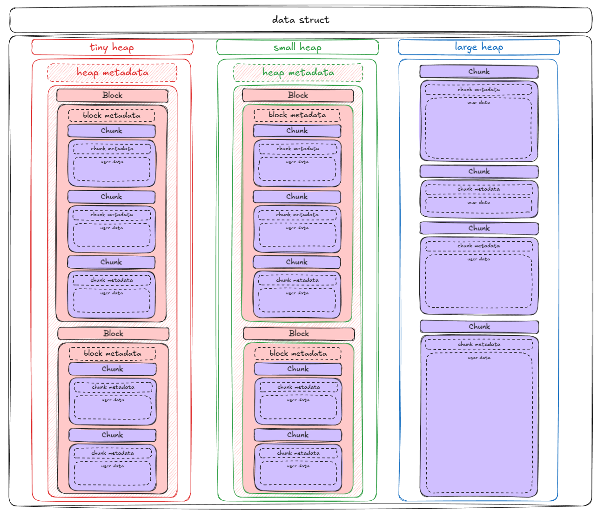

# MALLOC
Ce projet est une réimplémentation de la fonction malloc en C. L’objectif est d’acquérir une compréhension approfondie de la gestion dynamique de la mémoire.

## 💻 Installation

```sh
git clone git@github.com:Bonjoire/malloc.git
cd malloc
```

Créer la librairie partagée libft_malloc.so:
```sh
make
```

Tester le main:
```sh
make test
```

### Liste des fonctions implémentées:

```sh
void	*malloc(size_t size);
void	free(void *ptr);
void	*realloc(void *ptr, size_t size);
void	show_alloc_mem();
void	show_alloc_debug();
void    show_hexa_dump();
```

## 📝 Fonctionnalités

- Allocation dynamique de mémoire
- Gestion des blocs libres (défragmentation)
- Alignement de la mémoire
- Support multi-thread
- Affichage en hexadécimal

## ⚙️ Comment ça fonctionne ?

### MALLOC

- 1️⃣ **Pre-alloue la structure principale**  
- 2️⃣ **Alloue les metadata des block/chunk**  
- 3️⃣ **Alloue l'espace mémoire aligné sur 16 bytes dans la heap correspondante** (voir image ci-dessous)  
- 4️⃣ **Renvoyer le début de l'adresse allouée**

### FREE

- 1️⃣ **Libérer le chunk**  
- 2️⃣ **Libérer le bloc si nécessaire**  
- 3️⃣ **Défragmenter la mémoire (attribuer l'espace libéré à un autre chunk)**

### REALLOC

- 1️⃣ **MALLOC, un nouvel espace mémoire de la taille nécessaire**  
- 2️⃣ **Copier les données dans le nouvel espace mémoire**  
- 3️⃣ **FREE l'ancien espace mémoire**

## Structure

La structure data est séparée en **trois parties** : allocation de **petite taille** (PAGESIZE * 4), de **moyenne taille** (PAGESIZE * 128), et **grande taille** pour le reste des allocations. **PAGESIZE** en Linux est la taille d'une page mémoire, un bloc fixe (généralement 4 KB) utilisé par l'OS pour gérer, allouer et protéger la mémoire des processus.  
  
  

#### Définitions :

🎩 **Tiny & Small Heap** → Contiennent leurs métadonnées et un nombre indéterminé de blocs.  
🏗️ **Large Heap** → Contient ses métadonnées et un nombre indéterminé de chunks.  
🧱 **Block** → Contient ses métadonnées et au moins 100 chunks.  
🍫 **Chunk** → Contient ses métadonnées et les données utilisateur.  
📑 **Métadonnées** → Informations stockées avant/autour des allocations. (taille, taille libre/occupée, pointeurs pour la gestion des listes chaînées...)  

## 🔗 Ressources

- [Data structure alignment](https://en.wikipedia.org/wiki/Data_structure_alignment)
- [Memory mapping video](https://www.youtube.com/watch?v=8hVLcyBkSXY)
- [Defragmentation](https://en.wikipedia.org/wiki/Defragmentation)
- [Hex_dump](https://en.wikipedia.org/wiki/Hex_dump)
